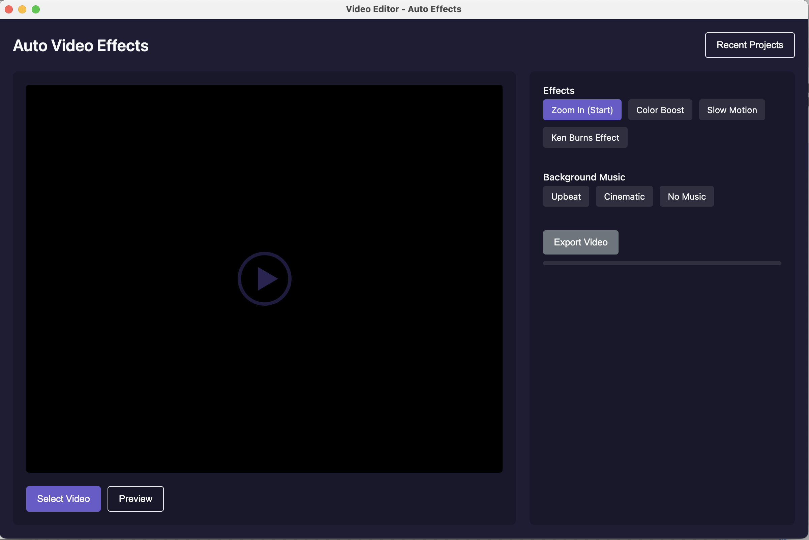

# Automatic Video Editor - Electron + Remotion

A desktop application for automatic video editing with visual effects and music. Built with Electron, TypeScript, and Remotion.



## Features

- 🎬 **Upload Local Videos**: Select and import your videos for editing
- 🪄 **Automatic Effects**: Apply professional effects with just a click
  - Vlog-style zoom in at the beginning
  - Color boost effects
  - Slow motion
  - Ken Burns effect (pan & zoom)
- 🎵 **Add Background Music**: Choose from royalty-free music tracks
- 📱 **Quick Rendering**: Fast video processing with progress tracking
- 💾 **High Quality Output**: Export in MP4 format, preserving original resolution

## Technology Stack

- **Electron**: Cross-platform desktop application framework
- **TypeScript**: Strongly typed JavaScript for robust code
- **Remotion**: React-based video editing library
- **FFmpeg**: Powerful video processing backend

## Development

### Prerequisites

- Node.js 16+ and npm

### Setup

1. Clone the repository
   ```
   git clone https://github.com/pH-7/video-editing-effect-remotion-electron.git
   cd video-editing-effect-remotion-electron
   ```

2. Install dependencies
   ```
   npm install
   ```

3. Run in development mode
   ```
   npm start
   ```

### Build

Build for your current platform:
```
npm run build
npm run dist
```

## Usage

1. Launch the application
2. Click "Select Video" to import your video file
3. Choose effects from the right panel
4. Select background music (optional)
5. Click "Export Video" to render with selected effects
6. Save the output file when prompted

## Project Structure

- `/src/main` - Electron main process
- `/src/renderer` - Electron renderer process (UI)
- `/src/remotion` - Remotion video compositions
- `/src/remotion/compositions/effects` - Individual video effects


## Who Baked This?

**Pierre-Henry Soria** — a super passionate and enthusiastic software engineer.
A genuine lover of cheese, coffee, and chocolate.
You can reach me at [pH7.me](https://ph7.me).

[](https://ph7.me "Pierre-Henry Soria’s personal website")


Do you enjoy this project? **[Support me with a yummy coffee](https://ko-fi.com/phenry)** — my go-to brew is (always) an almond flat white 😉

[![YouTube Tech Videos][youtube-icon]](https://www.youtube.com/@pH7Programming "My YouTube Tech Channel") [![@phenrysay][x-icon]](https://x.com/phenrysay "Follow Me on X") [![pH-7][github-icon]](https://github.com/pH-7 "Follow Me on GitHub") [![BlueSky][bsky-icon]](https://bsky.app/profile/pierrehenry.dev "Follow Me on BlueSky")


## License

This ElectronJS app is generously distributed under the [MIT License](LICENSE.md).


<!-- GitHub's Markdown reference links -->
[x-icon]: https://img.shields.io/badge/x-000000?style=for-the-badge&logo=x
[bsky-icon]: https://img.shields.io/badge/BlueSky-00A8E8?style=for-the-badge&logo=bluesky&logoColor=white
[youtube-icon]: https://img.shields.io/badge/YouTube-FF0000?style=for-the-badge&logo=youtube&logoColor=white
[github-icon]: https://img.shields.io/badge/GitHub-100000?style=for-the-badge&logo=github&logoColor=white
